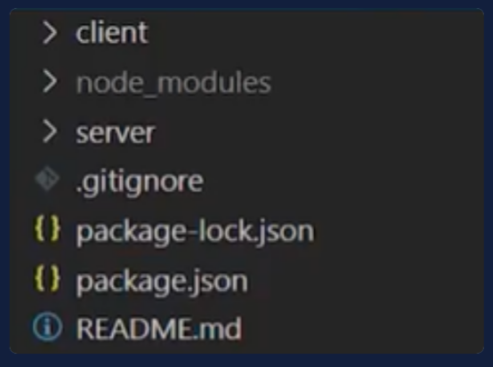

# Tu AS bajo la manga

Bienvenido/a al curso de `Manipulación de Arrays en JavaScript`. Esta vez conocerás los arrays en JavaScript, aprenderás desde cómo crearlos hasta los distintos métodos que tiene.

> Profesor: `Nicolas Molina`, Google Developer Expert.

## Requisitos iniciales

Como requisito inicial, deberás tener dos carpetas: `client` y `server` que servirán para ejercicios en el navegador y en el servidor, respectivamente. También necesitarás instalar una dependencia llamada `http-server`. Asimismo puedes clonar el repositorio de [GitHub del curso](https://github.com/platzi/curso-manipulacion-de-arrays/tree/main).

Si no conoces cómo iniciar un proyector para instalar dependencias, te recomiendo que realices el [curso de Gestión de Dependencias y Paquetes con NPM](https://platzi.com/cursos/npm/).

Te recomiendo usar Codi.link, es un editor de código para escribir HTML, CSS y JavaScript y visualizar el resultado a tiempo real. Daña el código, resuelve los problemas de cada clase o genera nuevos ejemplos que te ayuden a reforzar los temas aprendidos.
